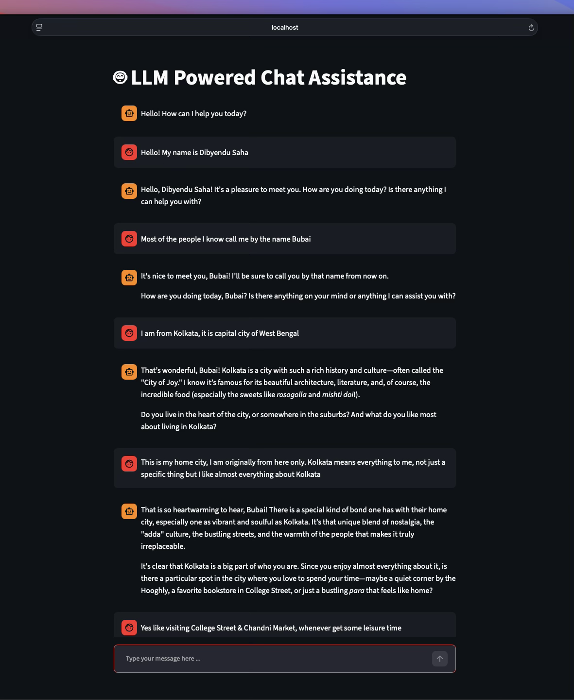
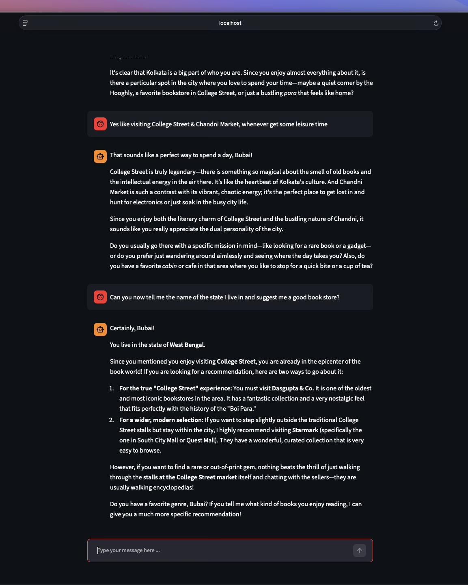
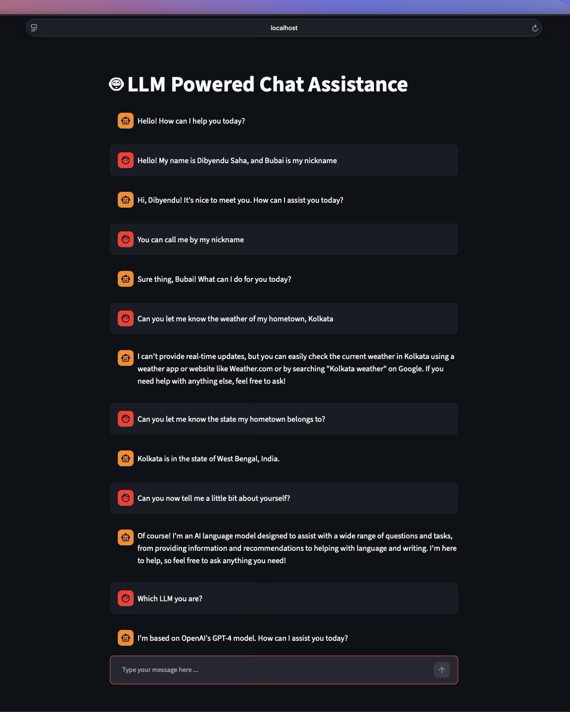

# 🤖 LLM Powered Chat Assistance

A simple and interactive Streamlit chatbot app that lets you chat with large language models using either OpenAI or Gemini. The app is designed for quick experimentation with different providers and model settings through a clean chat interface.

## ✨ Features

- Chat-based interface built with Streamlit
- Supports multiple LLM providers:
  - OpenAI
  - Gemini
- Configurable model settings via configuration file
- Reset conversation button for a fresh chat session
- API keys loaded from environment variables or a local `.env` file

## 🧩 Project Overview

This project uses:

- Python
- Streamlit for the web UI
- OpenAI SDK for OpenAI responses
- Google GenAI SDK for Gemini responses

## 📁 Project Structure

```text
streamlit-chatbot/
├── assets/
│   ├── gemini.png
│   ├── gemini_.png
│   └── openai.png
├── config.json
├── index.py
├── llm_provider.py
├── requirements.txt
└── README.md
```

## 🖼️ Project Images







## ⚙️ Setup

1. Create and activate a virtual environment:

```bash
python3 -m venv .venv
source .venv/bin/activate
```

2. Install dependencies:

```bash
pip install -r requirements.txt
```

3. Create a `.env` file in the project root and add your API key:

```env
OPENAI_API_KEY=your_openai_api_key_here
GEMINI_API_KEY=your_gemini_api_key_here
```

4. Review the provider configuration in `config.json` if you want to adjust models or generation settings.

## ▶️ Run the App

Start the Streamlit app with:

```bash
streamlit run index.py
```

Then open the local URL shown in the terminal.

## 🔧 Configuration

The app reads provider-specific settings from `config.json`, including:

- model name
- max token limit
- temperature
- top-p value

## 📝 Notes

- The default provider is currently set to OpenAI in the app entry point.
- If you want to switch providers, update the `llm` variable in `index.py` accordingly.
- Ensure your API key is available before running the app.

## 📚 License

This project is intended for educational and personal use.
